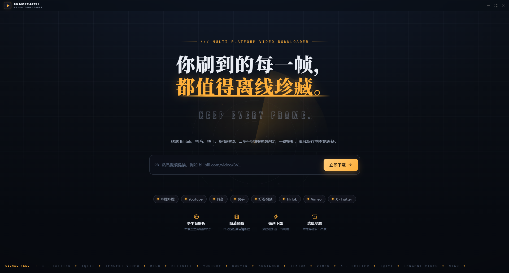
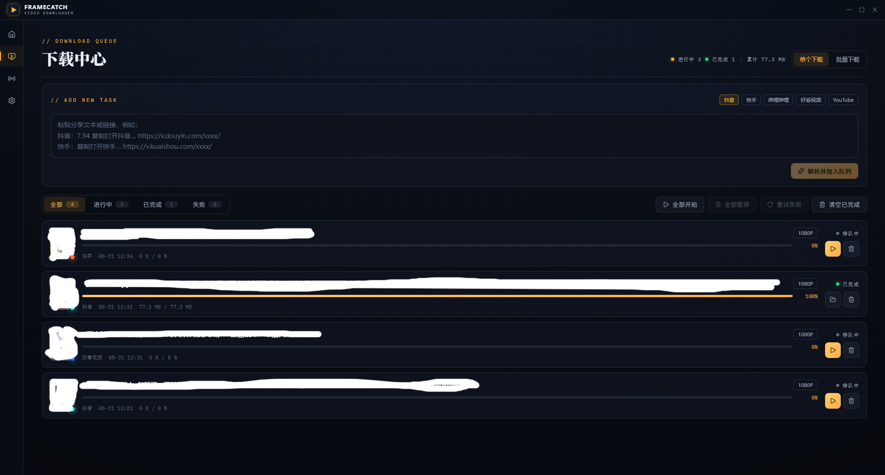

# FRAMECATCH

**多平台视频下载器 · Multi-platform Video Downloader**

基于 Tauri 的桌面应用，粘贴链接即可解析并离线保存 Bilibili、抖音、快手、好看视频 等平台的视频。

> **仅供个人学习与交流使用。禁止任何形式的商业用途、二次分发或转售，详见 [LICENSE](LICENSE.md)。**

---

## 下载

- 前往 **[Releases](../../releases/latest)** 下载最新安装包
- 应用内置自动更新，联网启动时会自动检测新版本

## 界面预览

## 支持的平台

| 状态     | 平台                              |
| -------- | --------------------------------- |
| 已支持   | Bilibili · 抖音 · 快手 · 好看视频 |
| 持续接入 | 更多平台规划中                    |

## 免责声明

- 本软件按"现状"（AS IS）提供，不附带任何明示或默示的担保。
- 使用本软件下载、解析的内容，请自行确认符合您所在地的法律法规及目标平台条款，相关责任由使用者自行承担。
- 本软件与任何视频平台均无关联、授权或合作关系，平台接口变更可能导致功能失效。
